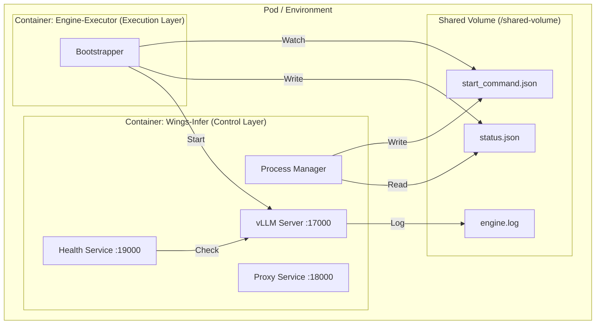
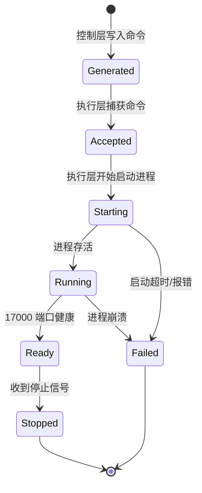

# Wings Sidecar 迁移方案 v5 (Copilot 增强版)

更新时间戳：`20260226-180748`
修订者：GitHub Copilot

## 1. 修订背景

基于 v4/v4-codex，本版重点完善“控制层”与“引擎层”的解耦契约，旨在实现跨运行时环境的兼容性。

**核心变更点：**
1.  **环境解耦**：明确“解耦后不再在拼命令阶段 `source` vLLM 虚拟环境”，解决跨镜像/跨环境移植问题。
2.  **协议标准化**：补齐“控制层与引擎层”的交互契约（共享卷文件协议 + 状态机流转 + 时序交互）。
3.  **Sidecar 模式明确**：确定采用双容器共享卷（EmptyDir/HostPath）的 Pod 内部架构。

当前仍为方案设计阶段，不涉及实际代码变更。

---

## 2. 范围与边界（MVP）

-   **部署架构**：Kubernetes Pod (Sidecar 模式) 或 Docker Compose。
-   **引擎支持**：仅 vLLM（未来可扩展）。
-   **网络端口规划**：
    | 组件 | 端口 | 说明 | 绑定地址 |
    | :--- | :--- | :--- | :--- |
    | **引擎后端** | `17000` | vLLM API Server | `127.0.0.1` (仅 Pod 内) |
    | **对外业务** | `18000` | Wings Proxy 业务入口 | `0.0.0.0` |
    | **健康探针** | `19000` | K8s Liveness/Readiness | `0.0.0.0` |
-   **代码复用**：继续优先复用 `wings/wings/proxy`（业务代理 + health 逻辑）。

---

## 3. 架构分层（解耦后）



### 3.1 控制层（wings-infer）
**核心职责：**
-   **配置管理**：参数解析与配置合并（对齐 `wings_start.sh` 语义）。
-   **指令下发**：引擎启动命令拼装（产物写入共享卷）。
-   **服务编排**：启动/监管 proxy（18000）与 health（19000）。
-   **生命周期**：信号处理（SIGTERM/SIGINT），负责优雅关闭整个业务流。

**明确不负责：**
-   在本容器内直接 fork/exec 引擎进程。
-   管理引擎运行时的 Python 虚拟环境（venv/conda）。

### 3.2 引擎执行层（开源组件执行器）
**核心职责：**
-   **命令监听**：监听共享卷中的命令文件生成事件。
-   **环境适配**：确保自身镜像内具备 vLLM 运行时环境。
-   **进程管理**：按产物启动 vLLM 进程并监听 `17000`。
-   **状态回上报**：实时回写进程状态、PID、错误信息到 `status.json`。

### 3.3 对外服务层（复用）
-   `proxy`：提供兼容 OpenAI/Wings 协议的业务接口（18000）。
-   `health_service`：提供 K8s 探针接口（19000），内部通过 `http://127.0.0.1:17000/health` 判定引擎存活。

---

## 4. 命令拼装约束（新增）

### 4.1 禁止项 (Anti-Patterns)
控制层生成的命令中，**严禁**包含特定环境的路径或激活脚本：
-   ❌ `source <venv>/bin/activate`
-   ❌ `conda activate ...`
-   ❌ 硬编码宿主机/特定镜像的 Python 路径（如 `/opt/conda/bin/python`）

### 4.2 允许项 (Best Practices)
-   ✅ 仅输出“可执行二进制名/模块名 + 参数 + 环境变量”。
-   ✅ 假设 `PATH` 在执行层容器中已正确配置。
-   ✅ 推荐优先输出结构化参数（JSON），Shell 脚本仅作为备选调试/兼容产物。

---

## 5. 控制层-引擎层交互协议（核心契约）

### 5.1 共享卷目录结构
```text
/shared-volume/
└── engine/
    ├── start_command.json      # [控制层写] 启动配置契约
    ├── start_command.sh        # [控制层写] 兼容性脚本 (可选)
    ├── status.json             # [执行层写] 运行时状态
    ├── engine.pid              # [执行层写] 进程号
    └── engine.log              # [执行层写] 标准输出/错误日志
```

### 5.2 `start_command.json` Schema 定义

```json
{
  "$schema": "http://json-schema.org/draft-07/schema#",
  "type": "object",
  "required": ["request_id", "engine", "backend_port", "argv"],
  "properties": {
    "request_id": { "type": "string", "description": "本次启动请求唯一标识" },
    "created_at": { "type": "string", "format": "date-time" },
    "engine": { "type": "string", "const": "vllm" },
    "backend_port": { "type": "integer", "default": 17000 },
    "argv": { 
      "type": "array", 
      "items": { "type": "string" },
      "description": "启动命令数组，避免 Shell 转义问题"
    },
    "env": { 
      "type": "object", 
      "description": "环境相关变量（MODEL_path, GPU_id 等）" 
    },
    "work_dir": { "type": "string" },
    "health_check_url": { "type": "string", "default": "http://127.0.0.1:17000/health" },
    "startup_timeout_sec": { "type": "integer", "default": 600 }
  }
}
```

### 5.3 状态机与 `status.json`

**状态流转图：**



**`status.json` 结构示例：**
```json
{
    "phase": "running", 
    "updated_at": "2026-02-26T18:10:00Z",
    "pid": 1024,
    "last_error": null,
    "exit_code": null
}
```

### 5.4 原子写入规则
为防止执行层读取到不完整的文件，控制层必须遵循：
1.  写入临时文件 `start_command.json.tmp`。
2.  调用 `fsync` 确保落盘。
3.  原子重命名 `mv start_command.json.tmp start_command.json`。
4.  最后更新 `status.json` 为 `generated` 状态 (可选，作为触发信号)。

---

## 6. 启动时序逻辑

```mermaid
sequenceDiagram
    participant K8s as Kubernetes/Docker
    participant Control as Control Layer (Wings-Infer)
    participant Volume as Shared Volume
    participant Engine as Engine Layer (vLLM)
    participant Health as Health Service (:19000)

    K8s->>Control: Start Container
    K8s->>Engine: Start Container (Waiting)
    
    rect rgb(240, 248, 255)
        note right of Control: Initialization Phase
        Control->>Control: Parse Args & Config
        Control->>Volume: Atomic Write start_command.json
        Control->>Volume: Write status.json (phase=generated)
    end

    parallel
        Control->>Control: Start Proxy (:18000)
        Control->>Control: Start Health (:19000)
    and
        loop Watch File
            Engine->>Volume: Check start_command.json
        end
        Engine->>Volume: Update status.json (phase=accepted)
        Engine->>Engine: Spawn vllm_server (subprocess)
        Engine->>Volume: Update status.json (phase=starting)
    end

    loop Health Check
        Engine->>Engine: Self Check (:17000/health)
        Engine->>Volume: Update status.json (phase=ready)
    end

    Health->>Engine: HTTP GET :17000/health
    Health-->>K8s: 200 OK (Ready)
```

**说明：**
- 控制层**不阻塞**等待 `17000` 就绪，它只负责“发射”命令。
- `19000` 端口的 Readiness Probe 负责将真正的业务可用性暴露给 K8s。

---

## 7. 健康与探针策略

-   **统一入口**：保持 `0.0.0.0:19000` 作为唯一 K8s 探针目标。
-   **Readiness 深度检查**：
    -   不仅检查 HTTP 状态码。
    -   推荐解析 Response Body，例如：确保 `status` 字段为 `ready` 且后端连接池已初始化。
    -   防止 vLLM 服务端启动但模型未加载完成时的 `200 OK` 假象（如果存在此类情况）。
-   **Liveness 存活检查**：
    -   简单检查 `httpGet /health` (19000)。

---

## 8. 示例产物展示

**`start_command.json` (推荐)**

```json
{
  "request_id": "req-20260226-001",
  "created_at": "2026-02-26T18:07:48+08:00",
  "engine": "vllm",
  "backend_port": 17000,
  "argv": [
    "vllm", "serve", "/models/qwen-7b",
    "--host", "0.0.0.0",
    "--port", "17000",
    "--tensor-parallel-size", "1",
    "--gpu-memory-utilization", "0.9"
  ],
  "env": {
    "NCCL_DEBUG": "INFO",
    "CUDA_VISIBLE_DEVICES": "0"
  },
  "work_dir": "/workspace",
  "health_url": "http://127.0.0.1:17000/health",
  "startup_timeout_sec": 600,
  "log_path": "/shared-volume/engine/engine.log"
}
```

---

## 9. 最小可验证流程 (MVP)

1.  **启动**：双容器启动，控制层写入配置。
2.  **握手**：执行层读取配置，状态变更为 `accepted` -> `starting`。
3.  **就绪**：执行层 vLLM 启动完毕，状态变更为 `ready`。
4.  **服务**：
    -   K8s 探测 `19000` 成功，Endpoint 生效。
    -   流量 -> `18000` (Proxy) -> `127.0.0.1:17000` (vLLM) -> 返回。
5.  **终止**：
    -   K8s 发送 `SIGTERM` 给控制层。
    -   控制层更新 `status.json` 为 `stopping` (可选)，并清理自身子进程。
    -   Kubernetes 同时发送 `SIGTERM` 给执行层容器，执行层优雅退出 vLLM。

---

## 10. 风险与对策 (v5)

| 风险点 | 描述 | 对策 |
| :--- | :--- | :--- |
| **协议漂移** | 执行层与控制层对 JSON 字段理解不一致 | 严格执行 Schema 校验，引入 `schema_version` 字段，不仅向后兼容。 |
| **环境残留** | 仍残留 source venv 依赖 | 生成器增加“黑名单关键字检查”，单元测试覆盖生成的命令行。 |
| **命令转义** | Shell 脚本处理特殊字符失败 | **放弃所有 Shell 脚本执行路径**，仅使用 `execvp` 风格的数组参数启动进程。 |
| **僵尸进程** | 控制层退出后引擎层未感知 | 依赖 K8s Pod 生命周期管理（Sidecar 随 Pod 销毁）；执行层也可监听父进程/Status 文件变化自动退出。 |
| **假死状态** | vLLM 进程在但无法响应 | `19000` 健康检查需包含超时逻辑；连续失败 N 次后触发 K8s 重启 Pod。 |

---

## 11. 结论

v5 Copilot 增强版进一步明确了 **Sidecar 协作模式**：

1.  **控制层** (Wings-Infer) 退化为纯粹的 **ConfigManager + Proxy + Watchdog**。
2.  **执行层** (Engine) 进化为 **Autonomous Executor**，自我管理生命周期。
3.  通过 **JSON 契约 + 共享存储** 替代了脆弱的 Shell 脚本注入，彻底解决了跨环境的依赖问题。
